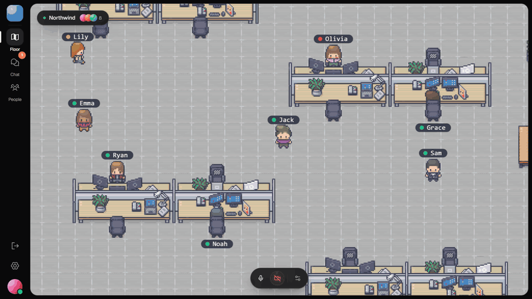
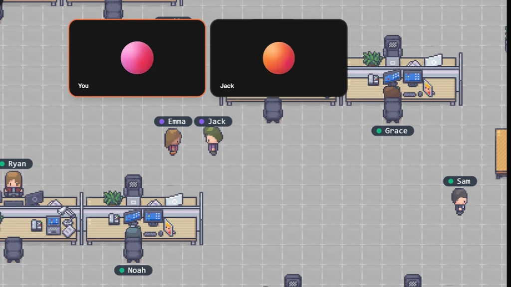
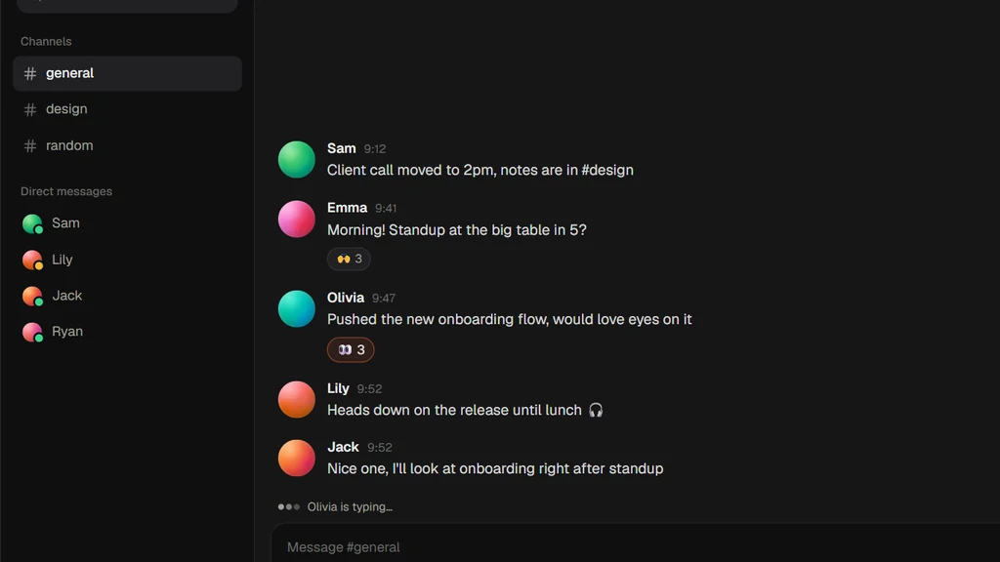
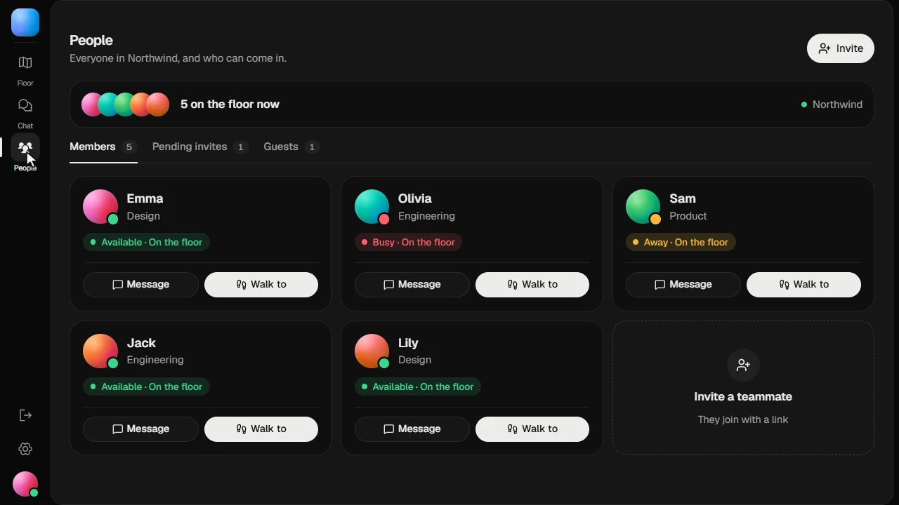

  <a href="https://www.tinyfloor.com">
    <picture>
      <source media="(prefers-color-scheme: dark)" srcset=".github/readme/logo-dark.svg">
      
    </picture>
  </a>

<h1 align="center">TinyFloor</h1>

  <b>The open-source virtual office your team can walk around in.</b> 
  Walk up to someone to talk. Pull up a chair to meet. Nothing to install.

  <a href="https://www.tinyfloor.com"><b>Website</b></a> ·
  <a href="https://www.tinyfloor.com/lobby"><b>Walk into the lobby</b></a> ·
  <a href="https://www.tinyfloor.com/create"><b>Make an office</b></a> ·
  <a href="#questions"><b>Questions</b></a>

  
  
  

  <a href="https://www.tinyfloor.com/lobby">
    <picture>
      <source srcset=".github/readme/tour.avif" type="image/avif">
      
    </picture>
  </a>

## A virtual office for remote teams

Remote work lost the hallway: the quick question at someone's desk, the hello on the way past, seeing who's around. Video calls turned every one of those into a scheduled meeting.

TinyFloor is a 2D virtual office in your browser. Your team walks around a shared pixel-art floor as characters, and **proximity video chat** does the rest: walk up to someone to talk, sit at a table to meet, stand up when you're done. The office stays open all day, so remote work feels like working side by side again.

## Features

<table>
  <tr>
    <td width="33%"></td>
    <td width="33%"></td>
    <td width="33%"></td>
  </tr>
  <tr>
    <td><b>Proximity video calls</b> Walk up to a teammate and one tap starts video or voice.</td>
    <td><b>Team chat</b> Channels, direct messages and reactions that stay.</td>
    <td><b>Presence</b> See who's in, busy or in a call, then walk right over.</td>
  </tr>
</table>

- **Meeting tables** for group video calls with screen sharing. Sit down to join, stand up to leave.
- **Guest links** let clients and candidates in with a name and a character, no account needed.
- **Whiteboard and room music** for the moments between calls.
- **Works in the browser** on desktop and mobile, with nothing to download, in 18 languages.
- **Private offices** for your team, and a public lobby anyone can walk into.

## Made for

- **[Virtual office](https://www.tinyfloor.com/virtual-office)**: one room your remote team keeps open all day.
- **[Virtual coworking](https://www.tinyfloor.com/virtual-coworking)**: work side by side online and take breaks together.
- **[Online study room](https://www.tinyfloor.com/online-study-room)**: study with friends, focus quietly, talk when you need a break.
- **[Virtual classroom](https://www.tinyfloor.com/virtual-classroom)**: office hours, tutoring and small classes.
- **[Proximity chat](https://www.tinyfloor.com/proximity-chat)**: talk to whoever you walk up to, like in a real room.

## An open-source alternative

Looking for an open-source alternative to [Gather](https://www.tinyfloor.com/gather-alternative), [Kumospace](https://www.tinyfloor.com/kumospace-alternative), [SpatialChat](https://www.tinyfloor.com/spatialchat-alternative), [WorkAdventure](https://www.tinyfloor.com/workadventure-alternative) or [Wonder](https://www.tinyfloor.com/wonder-alternative)? TinyFloor keeps the core of a virtual office and does it well: moving around, proximity calls, meeting tables, screen sharing and chat.

## Questions

### How does proximity video chat work?

Walk up to someone and call buttons appear next to them. Tap one to start video or voice. Calls run over WebRTC through Cloudflare's network, so they connect on any office or home network.

### Do I need to install anything?

No. TinyFloor runs in any modern browser on desktop and mobile. Open a link and you're in the office.

### How is it different from Zoom or Google Meet?

Zoom and Meet put everyone in one grid until the meeting ends. A TinyFloor office stays open all day, so you can see who's around and talk to whoever you walk over to, without scheduling a call.

### Is it private?

An office is only for its members and the guests they let in. Nothing inside it is public or indexed, and calls are encrypted in transit.

## Open source

TinyFloor is open source under the [GNU AGPL v3.0](LICENSE) and runs on Cloudflare Workers, Durable Objects and D1, with a Next.js front end. The TinyFloor name and logo are ours, and the pixel art belongs to its artists ([credits](frontend-nextjs/public/credits.txt), [ASSETS.md](ASSETS.md)).

Questions or ideas? Write to [support@tinyfloor.com](mailto:support@tinyfloor.com).
