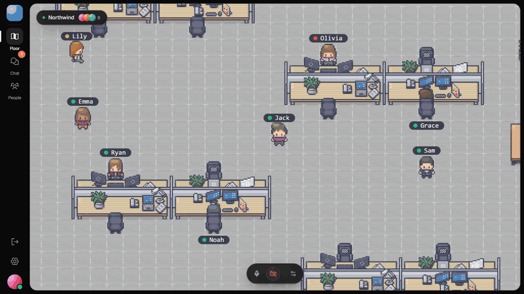
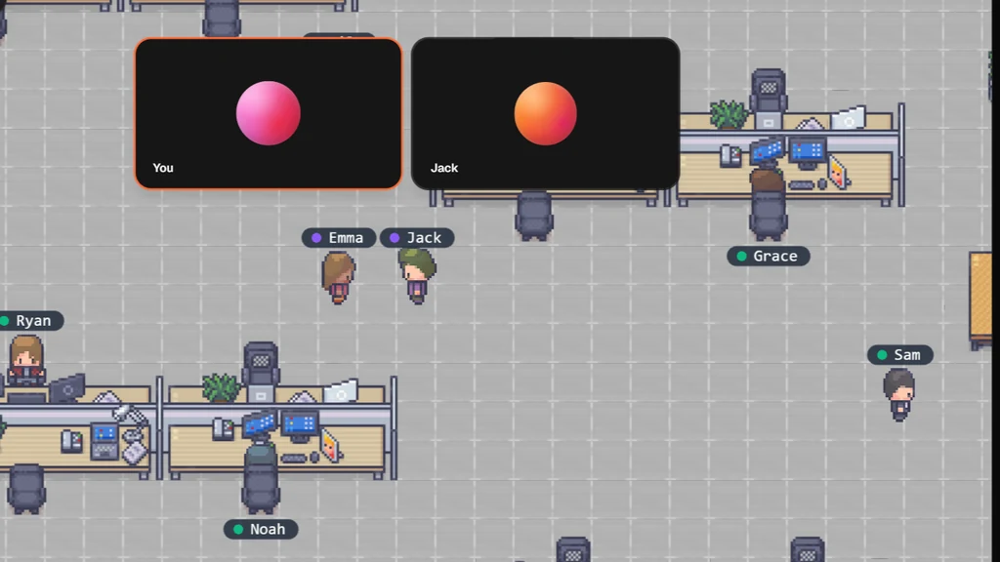
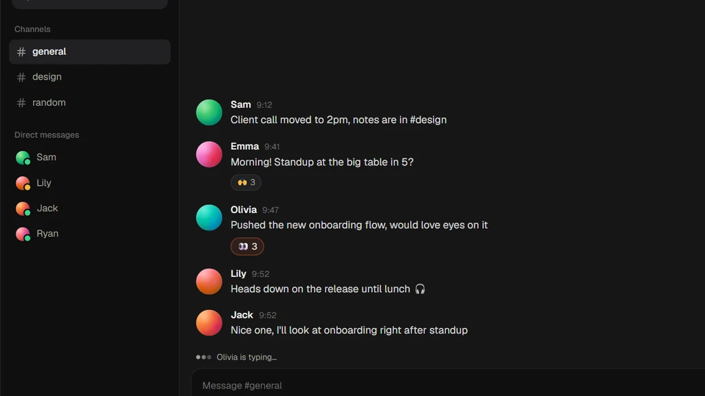
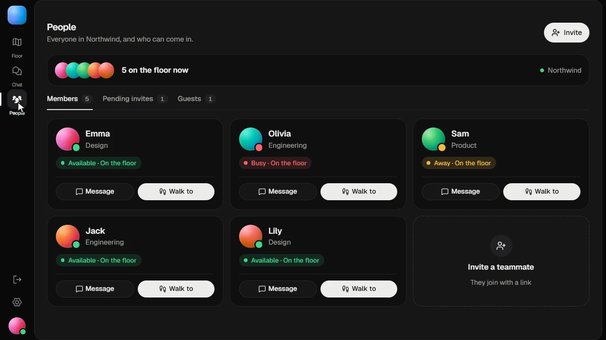

  <a href="https://www.tinyfloor.com">
    <picture>
      <source media="(prefers-color-scheme: dark)" srcset=".github/readme/logo-dark.svg">
      
    </picture>
  </a>

<h1 align="center">TinyFloor</h1>

  <b>The virtual office your team can walk around in.</b> 
  Walk up to someone to talk. Pull up a chair to meet. Free for up to 3 people.

  <a href="https://www.tinyfloor.com"><b>Website</b></a> ·
  <a href="https://www.tinyfloor.com/lobby"><b>Try the demo office</b></a> ·
  <a href="https://www.tinyfloor.com/create"><b>Make an office</b></a> ·
  <a href="#pricing"><b>Pricing</b></a> ·
  <a href="#questions"><b>Questions</b></a>

  
  
  

  <a href="https://www.tinyfloor.com/lobby">
    <picture>
      <source srcset=".github/readme/tour.avif" type="image/avif">
      
    </picture>
  </a>

## A virtual office for remote teams

Remote work lost the hallway: the quick question at someone's desk, the hello on the way past, seeing who's around. Video calls turned every one of those into a scheduled meeting.

TinyFloor is a 2D virtual office in your browser. Your team walks around a shared pixel-art floor as characters, and **proximity video chat** does the rest: walk up to someone to talk, sit at a table to meet, stand up when you're done. The office stays open all day, so remote work feels like working side by side again.

It's a hosted service at **[tinyfloor.com](https://www.tinyfloor.com)**: make an office in a minute, send your team the invite link, and you're working together. There's nothing to install or run. It's built for small teams, from 2 to 25 people.

## Features

<table>
  <tr>
    <td width="33%"></td>
    <td width="33%"></td>
    <td width="33%"></td>
  </tr>
  <tr>
    <td><b>Proximity video calls</b> Walk up to a teammate and one tap starts video or voice.</td>
    <td><b>Team chat</b> Channels, direct messages and reactions that stay.</td>
    <td><b>Presence</b> See who's in, busy or in a call, then walk right over.</td>
  </tr>
</table>

- **Meeting tables** for group video calls with screen sharing. Sit down to join, stand up to leave.
- **Invite links** bring teammates in: they pick a name and a character and join with a free account.
- **Whiteboard and room music** for the moments between calls.
- **Works in the browser** on desktop and mobile, with nothing to download, in 18 languages.
- **Private offices** for your team, joined by invite, and a demo office to try it first.

## Made for

- **[Engineering teams](https://www.tinyfloor.com/engineering-teams)**, **[design teams](https://www.tinyfloor.com/design-teams)**, **[startups](https://www.tinyfloor.com/startups)** and **[agencies](https://www.tinyfloor.com/agencies)**.
- **[Virtual office](https://www.tinyfloor.com/virtual-office)**: one room your remote team keeps open all day.
- **[Virtual standup](https://www.tinyfloor.com/virtual-standup)**, **[remote pair programming](https://www.tinyfloor.com/remote-pair-programming)** and **[remote onboarding](https://www.tinyfloor.com/remote-onboarding)**.
- **[Virtual coworking](https://www.tinyfloor.com/virtual-coworking)**: heads-down hours with your team, and a **[virtual watercooler](https://www.tinyfloor.com/virtual-watercooler)** between them.
- **[Virtual classroom](https://www.tinyfloor.com/virtual-classroom)**: office hours, tutoring and small classes.

## Pricing

One price for the whole office, not one per person. Every plan has every feature.

| Plan | People | Price | Group meeting hours |
|---|---|---|---|
| **Free** | Up to 3 | $0, forever, no card | 5 a month |
| **Plus** | Up to 10 | $19 a month ($1.90 a person) | 30 a month |
| **Pro** | Up to 25 | $49 a month ($1.96 a person) | 60 a month |

Calls between two people are never counted. Prices are in US dollars, before tax. [See the pricing page](https://www.tinyfloor.com/pricing).

**What a team of 10 pays each month:** $19 on TinyFloor Plus, against $120 or more on a per-person tool like Gather, whose Essential plan starts at $12 per member per month.

## Compared with other virtual offices

Moving from [Gather](https://www.tinyfloor.com/gather-alternative), [Kumospace](https://www.tinyfloor.com/kumospace-alternative), [SpatialChat](https://www.tinyfloor.com/spatialchat-alternative), [WorkAdventure](https://www.tinyfloor.com/workadventure-alternative), [Wonder](https://www.tinyfloor.com/wonder-alternative), [Sococo](https://www.tinyfloor.com/sococo-alternative), [oVice](https://www.tinyfloor.com/ovice-alternative), [Roam](https://www.tinyfloor.com/roam-alternative) or [Teamflow](https://www.tinyfloor.com/teamflow-alternative)? TinyFloor keeps the core of a virtual office and does it well: moving around, proximity calls, a meeting room, screen sharing and chat, for one flat price. Each link compares the two side by side, and there's [every comparison in one place](https://www.tinyfloor.com/compare).

TinyFloor deliberately leaves things out: there are no custom map editors, recordings or AI meeting notes. If your team wants a simple office that stays open all day, that's what it does.

## Questions

### How does proximity video chat work?

Walk up to someone and call buttons appear next to them. Tap one to start video or voice. Calls run over WebRTC through Cloudflare's network, so they connect on any office or home network.

### Do I need to install anything?

No. TinyFloor runs in any modern browser on desktop and mobile. Open a link and you're in the office.

### How is it different from Zoom or Google Meet?

Zoom and Meet put everyone in one grid until the meeting ends. A TinyFloor office stays open all day, so you can see who's around and talk to whoever you walk over to, without scheduling a call.

### Is it private?

An office is only for its members. Nothing inside it is public or indexed, and calls are encrypted in transit.

### Is TinyFloor free?

Yes, for up to 3 people, with every feature and no card. Bigger teams move to Plus ($19 a month for up to 10 people) or Pro ($49 a month for up to 25).

### Can I try it without signing up?

Yes. The [demo office](https://www.tinyfloor.com/lobby) needs only a name. Making your own office takes a free account with Google or email.

### Is it open source?

Yes, under the AGPL v3.0. The code is here, and the hosted service at tinyfloor.com is how teams use it: it runs on Cloudflare's network, with calls, chat and storage taken care of.

## Open source

TinyFloor's code is open source under the [GNU AGPL v3.0](LICENSE). It runs on Cloudflare Workers, Durable Objects and D1, with a Next.js front end. The TinyFloor name and logo are ours, and the pixel art belongs to its artists ([credits](frontend-nextjs/public/credits.txt), [ASSETS.md](ASSETS.md)).

Questions or ideas? Write to [support@tinyfloor.com](mailto:support@tinyfloor.com).
